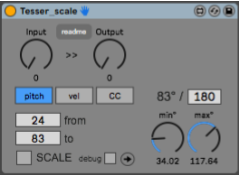

This Patch is part of the [TESSER environment](https://bitbucket.org/AdrianArtacho/tesserakt/src/master/).

# Tesser_scale

This README would normally document whatever steps are necessary to get your application up and running.

### What is this repository for?

* Quick summary
* Version
* [Learn Markdown](https://bitbucket.org/tutorials/markdowndemo)

____

# To-Do

* Summary of set up
* Configuration
* Dependencies
* Database configuration
* How to run tests
* Deployment instructions
* display notation
* color coding: BLUE for settings. GREEN for outgoing messages. YELLOW/RED/ORANGE... for incomming messages of different kinds. Establish a protocol. Check the [gt_server] object to check which colors I used there and try to be consistent
* Big [live.dial] mappable object for the INPUT (I will need with Glover)
* make it microtone-polyphony-capable (speak seamlessly with gt_Transmitter)
